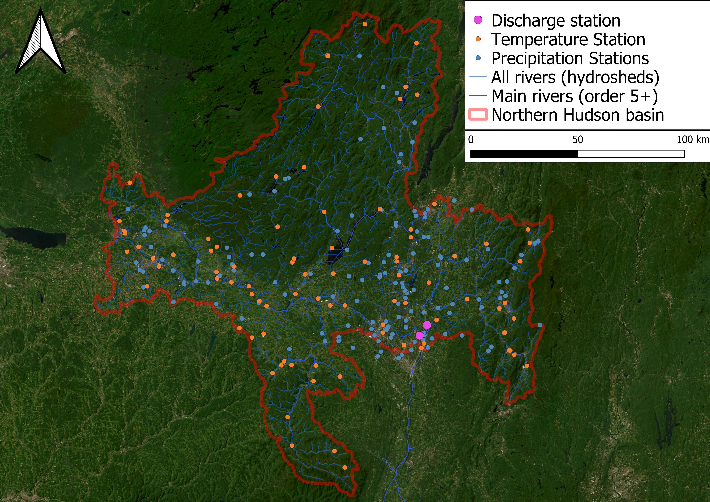

# Modeling of the Hudson basin, New York, USA.
Catchment model for the course ENVM1502

##### reproducability
The files [requirement_envm1502.txt](https://github.com/Daafip/ENVM1502-Catchment-model/blob/main/requirements_envm1502.txt) for pip or  [requirement_envm1502.yml](https://github.com/Daafip/ENVM1502-Catchment-model/blob/main/requirement_envm1502.yml) for conda contain all the packagenames needed to run the jupyter notebooks provided. 

Simply run `conda env create -f requirement_envm1502.yml` in the anaconda promt with the `.yml` located correctly (recommended), or use  `pip install -r requirements_envm1502.txt`. 
The [MEV](https://github.com/EnricoZorzetto/mevpy) package is the only one which needs to be downloaded seperately & moved to the correct install folder with other python packages. 
##### to do: change this image 

##### Work overview:
| Unit        | What                | To dos                                 | Who   | Done?  |  Result                 |
| :----:      | ----                | ----                                   |:----: | :----: | ----                    |
| 0.1         | P data (& T)        | Precip data, likely also temp          | Anne  | Yes    | loaded in from NOAA     |
| 0.1.3       | P data reweighing   | use theissen polygon rather than mean  | David | Yes    | completed,more promising|  
| 0.2         | Q data              | From UGSG                              | David | Yes    | loaded in               |  
| 0.3         | EP data             | from satelite product?                 | David | Yes    | GLEAM used in the end   | 
| 0.4         | Combining all data  | take the mentioned data & load in      | David | Yes    | one dataframe made      |  
| ----        | ----                | ----                                   | ----  | ----   | ----                      |
| 1.1         | Budyko curve        | Plotting Ea/P vs EP/p &  desribing     | Anne  | Yes    | Plots nicely on the curve|  
| 1.2         | EVA                 | Creating MEV & GEV                     | David | Yes    | clear line obtained      |
| 1.3         | Vegetation          | Estimate rootzone storage              | Anne  | Yes    | estimated 73.86mm       |
| 1.4         | snow                | Estimate snow storage & melt           | David | Yes    | modeled nicely on 4 plateaus |  
| 1.5         | Muskingum           | Flood routing                          | Anne  | Yes    | Completed, takes long, little use   |
| 1.6         | Mositure recycle    | Local mositure                         | David | Yes    | Most moisture from sea, little recycling |
| ----        | ----                | ----                                   | ----  | ----   | ----                    |
| 2.1         | map reservoirs      | Use landsat to select surface water    | David | Yes    | Map showing 371km^2 of reservoirs |
| 2.2         | remote P measure    | analyse P with satilites/microwave obs | Anne  | NA     | Not done due to enough data|
| 2.3         | moisture            | map soil moisture                      | David | Yes    | Insitu, microwave,SMAP & CCDS loaded in|
| 2.4         | DEMS & gravity      | Use dem & estimate S using grace       | Anne  | Yes    | Grace loaded in, also used in 2.6, decrease water storages|
| 2.5         | Evaporation         | extract evaporation from rs            | David | Yes    | loaded from era 5, see 0.3|
| 2.6 & 7     | Data assimilation   | tweak data to close waterbalance       | Both  | Yes    | Now use Gleam instead of era5 |
| 2.8         | Climate predictions | Look at monthly precipitation predict  | David | Yes    | extreme precipitation will increase    |
| ----        | ----                | ----                                   | ----  | ----   | ----                    |
| 3.1         | Linear reservoir    | K & alpha values                       | Anne  | Yes    | too simple, but shows good    |
| 3.2         | lumped model        | Insert values into model               | Anne  | Yes    | shows promising results, gets timing right, mainly summer overshoots |
| 3.3         | callibration        | callibrate values in model             | Anne  | Yes    | see above                        |
| 3.4         | distributed model   | Use landscape and divide into gridcells| Anne  | Yes    | underestimates snow                        |
| ----        | ----                | ----                                   | ----  | ----   | ----                    |
| 4.0         | overview nb         | Combine everything                     | David | Yes    |  all combined & run                       |
