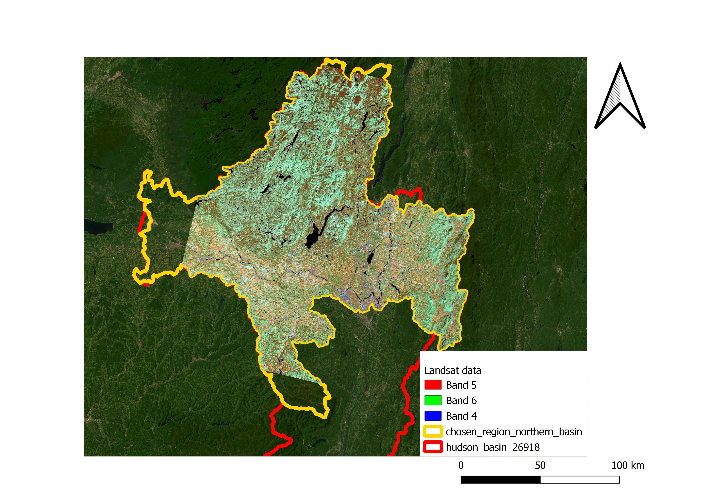

# Modeling of the Hudson basin, New York, USA.
Catchment model for the course ENVM1502

##### to do: change this image 

##### Work overview:
| Unit        | What                | To dos                                 | Who   | Done?  |  Result                 |
| :----:      | ----                | ----                                   |:----: | :----: | ----                    |
| 0.0         | P data (& T)        | Precip data, likely also temp          | Anne  | Yes    | loaded in               |  
| 0.0         | Q data              | From UGSG                              | David | Yes    | loaded in               |  
| 0.0         | EP data             | from satelite product?                 | David | Yes    | era5 loaded in          | 
| ----        | ----                | ----                                   | ----  | ----   | ----                    |
| 1.1         | Budyko curve        | Plotting Ea/P vs EP/p &  desribing     | Anne  | Yes    | Done, needs comments    |  
| 1.2         | EVA                 | Creating MEV & GEV                     | David | Yes    | Done, needs comments    |
| 1.3         | Vegetation          | Estimate rootzone storage              | Anne  | Yes    | Done, needs comments    |
| 1.4         | snow                | Estimate snow storage & melt           | David | Yes    | Done, some commments    |  
| 1.5         | Muskingum           | Flood routing                          | Anne  | Yes    | Done, some commments    |
| 1.6         | Mositure recycle    | Local mositure                         | David | Yes    | Done, commented         |
| ----        | ----                | ----                                   | ----  | ----   | ----                    |
| 2.1         | map reservoirs      | Use landsat to select surface water    | David | Yes    | Done, commented         |
| 2.2         | remote P measure    | analyse P with satilites/microwave obs | Anne  |        | write up why not needed |
| 2.3         | moisture            | map soil moisture                      | David |        |                         |
| 2.4         | DEMS & gravity      | Use dem & estimate S using grace       | Anne  |        |                         |
| 2.5         | Evaporation         | extract evaporation from rs            | David | Yes    | not availible in area   |
| 2.6         | Data assimilation   | tweak data to close waterbalance       | Anne  |        |                         |
| ----        | ----                | ----                                   | ----  | ----   | ----                    |
| 3.1         | Linear reservoir    | K & alpha values                       | Anne  | Yes    | Done, some commments    |
| 3.2         | lumped model        | Insert values into model               | Anne  |        |                         |
| 3.3         | callibration        | callibrate values in model             |       |        |                         |
| 3.4         | distributed model   | Use landscape and divide into gridcells|       |        |                         |
| ----        | ----                | ----                                   | ----  | ----   | ----                    |
| 4.0         | overview nb         | Combine everything                     | David |        |                         |
